# Real Estate Market Analysis
## Executive Business Intelligence Report

---

## Executive Summary

This analysis examines **24,322 active property listings** across the Azerbaijan real estate market, providing critical insights to inform strategic business decisions. The market shows strong concentration in specific property types and geographic regions, with clear patterns in pricing, inventory distribution, and customer preferences.

**Key Market Indicators:**
- **Average Property Price:** 160,053 AZN
- **Median Property Price:** 129,500 AZN
- **Average Price per Square Meter:** 1,628 AZN
- **Average Property Size:** 124 m²
- **Primary Market:** Baku (73.4% of inventory)

---

## 1. Market Composition & Inventory Strategy

### What the Data Shows

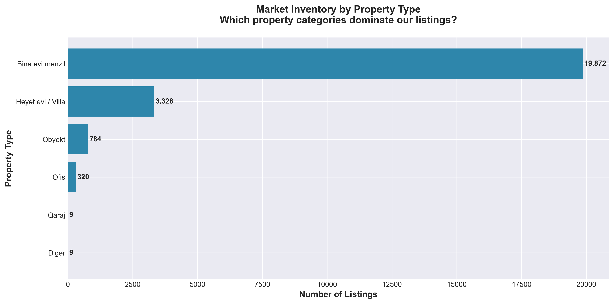

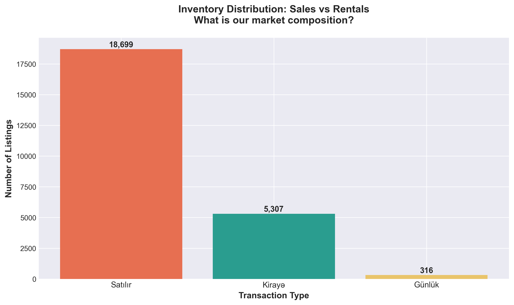

**Transaction Mix:**
- **Sales:** 76.9% (18,699 listings) - Core business segment
- **Long-term Rentals:** 21.8% (5,307 listings) - Significant secondary market
- **Short-term Rentals:** 1.3% (316 listings) - Niche opportunity

**Property Type Dominance:**
- **Residential Apartments** (Bina evi menzil): 81.7% of total inventory
- **Houses/Villas** (Həyət evi): 13.7%
- **Commercial Properties** (Obyekt): 3.2%
- **Offices:** 1.3%

### Business Implications

The market is **overwhelmingly concentrated in residential apartment sales**, which represent over 3 out of 4 transactions. This concentration creates both opportunity and risk:

**Strategic Considerations:**
- **Portfolio Risk:** Heavy dependency on a single property type makes the business vulnerable to residential market fluctuations
- **Rental Market Opportunity:** The 21.8% rental segment represents significant recurring revenue potential that may be underutilized
- **Short-term Rental Gap:** Only 1.3% of inventory serves daily rentals, suggesting an untapped tourism/business travel market
- **Commercial Property Premium:** Commercial properties command higher average prices (251,333 AZN) but represent only 3.2% of inventory

### Recommended Actions

1. **Diversification Strategy:** Consider expanding commercial property offerings to reduce dependency on residential sales
2. **Rental Growth Initiative:** Develop specialized rental management services to capture more of the 22% rental market
3. **Short-term Rental Expansion:** Explore partnerships with tourism platforms to grow the underserved daily rental segment
4. **Market Segmentation:** Create specialized teams for residential vs. commercial properties given their different price points and customer needs

---

## 2. Geographic Market Dynamics

### What the Data Shows

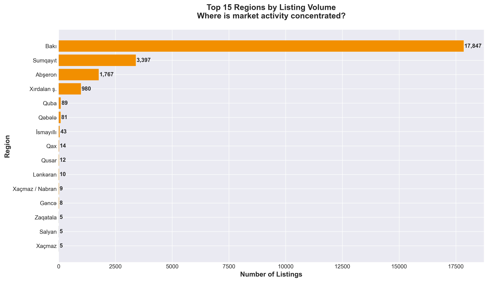

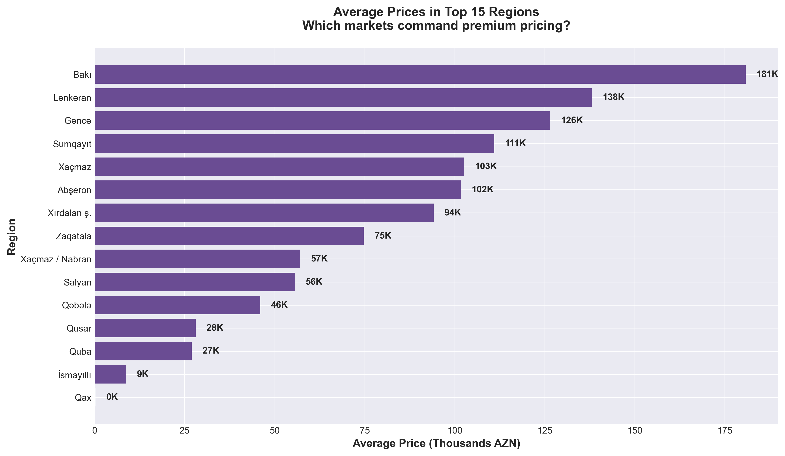

**Market Concentration:**
- **Baku:** 73.4% of all listings (17,847 properties) - Average price: 180,798 AZN
- **Sumqayit:** 14.0% (3,397 properties) - Average price: 110,960 AZN
- **Absheron:** 7.3% (1,767 properties) - Average price: 101,725 AZN
- **Khirdalan:** 4.0% (980 properties) - Average price: 94,127 AZN

### Business Implications

**Baku commands a 63% price premium** over secondary markets (Sumqayit, Absheron), while representing nearly three-quarters of total inventory. This reveals:

**Market Insights:**
- **Capital City Dominance:** Baku is the undisputed primary market, but may be approaching saturation with 17,847 active listings
- **Secondary Market Value Gap:** Sumqayit and Absheron offer properties at 40-45% lower prices, potentially attracting price-sensitive buyers
- **Regional Growth Potential:** Secondary cities have significantly lower competition (fewer listings) but still substantial populations
- **Price Arbitrage Opportunity:** The large price gap between regions suggests potential for investment strategies targeting appreciation in emerging markets

### Recommended Actions

1. **Baku Premium Positioning:** Maintain strong presence in Baku but focus on premium segments to justify higher commission potential
2. **Secondary Market Expansion:** Increase market share in Sumqayit and Absheron where competition is lighter and growth potential exists
3. **First-time Buyer Programs:** Target secondary markets for first-time buyers priced out of Baku
4. **Investment Advisory Services:** Help investors identify value opportunities in secondary markets with growth trajectories
5. **Regional Specialization:** Assign dedicated agents to each major region to build local expertise and networks

---

## 3. Pricing Strategy & Market Segmentation

### What the Data Shows

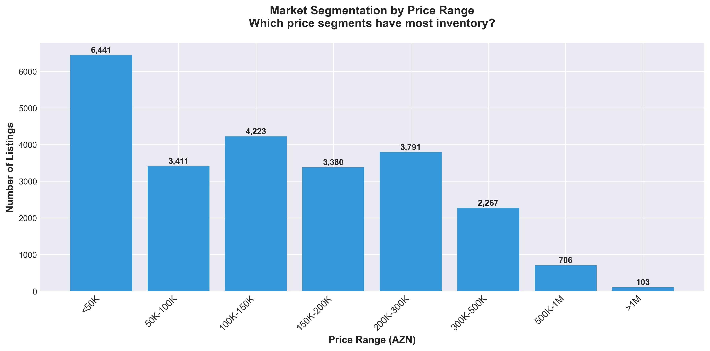

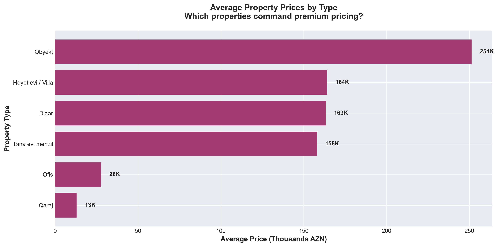

**Price Segment Breakdown:**
- **Budget (<100K AZN):** 40.1% of market (9,751 listings)
- **Mid-Range (100K-200K):** 31.2% (7,586 listings)
- **Premium (200K-500K):** 25.2% (6,138 listings)
- **Luxury (>500K):** 3.5% (847 listings)

**Property Type Pricing:**
- **Commercial Properties:** 251,333 AZN average (59% premium vs. overall market)
- **Houses/Villas:** 164,084 AZN (2% premium)
- **Residential Apartments:** 157,974 AZN (baseline)
- **Offices:** 27,676 AZN (likely smaller units)

### Business Implications

The market shows a **classic pyramid structure** with 71% of inventory priced under 200K AZN, but **premium and luxury segments (28.7%) likely generate disproportionate revenue** given higher absolute prices and commission potential.

**Critical Insights:**
- **Mass Market Saturation:** Budget and mid-range segments have intense competition with nearly 17,000 active listings
- **Premium Opportunity:** 6,138 premium listings represent high-value transactions with better commission margins
- **Luxury Niche:** 847 luxury properties (>500K) require specialized marketing and agent expertise
- **Commercial Premium:** Commercial properties command 59% higher prices but represent only 3.2% of listings - potential underserved niche

### Recommended Actions

1. **Segment-Specific Marketing:**
   - **Budget/Mid-Range:** High-volume, digital-first approach with automated lead nurturing
   - **Premium:** Personalized service, professional photography, targeted advertising
   - **Luxury:** White-glove service, exclusive events, international marketing

2. **Agent Specialization:** Train and certify "luxury specialists" to better serve the high-value segment

3. **Commission Structure Optimization:** Consider volume-based incentives for budget/mid-range vs. higher percentage for luxury to align agent motivation with profit potential

4. **Commercial Property Expansion:** Given 59% price premium and low competition, develop commercial real estate expertise as a strategic differentiator

5. **Portfolio Rebalancing:** If current agent time is evenly distributed, shift focus toward premium/luxury segments where commission potential is higher

---

## 4. Unit Size & Customer Preferences

### What the Data Shows

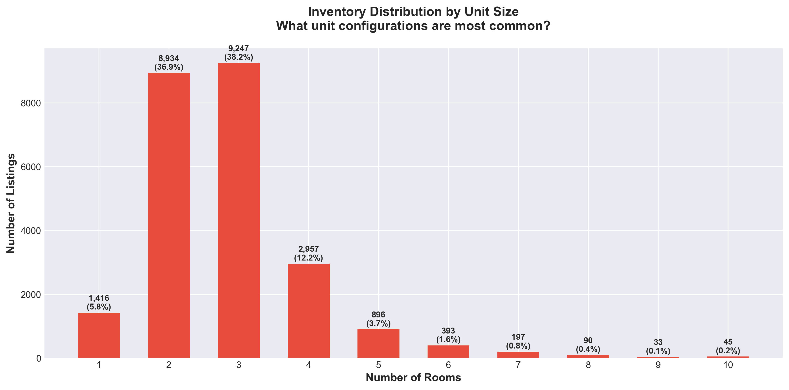

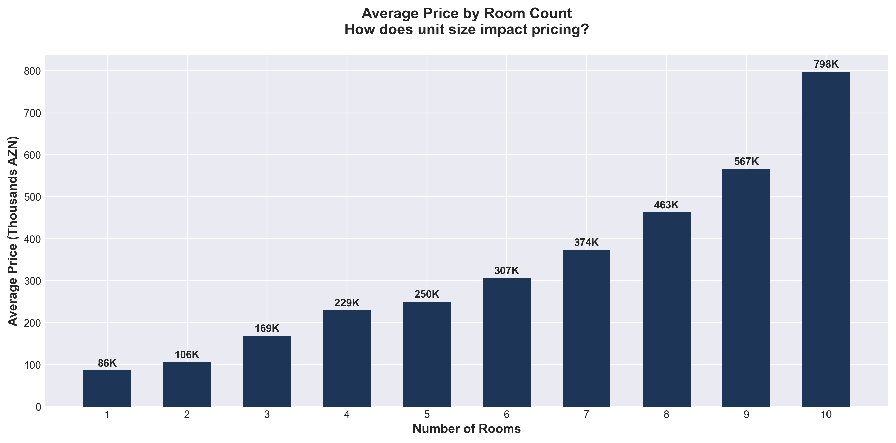

**Unit Configuration Preferences:**
- **3-room apartments:** 38.0% of market (most popular) - Average: 168,607 AZN
- **2-room apartments:** 36.7% (second most popular) - Average: 106,316 AZN
- **4-room apartments:** 12.2% - Average: 229,317 AZN
- **1-room apartments:** 5.8% - Average: 86,292 AZN
- **5+ room units:** 5.3% - Average: 250,000+ AZN

### Business Implications

**The market is heavily concentrated in 2-3 room units (74.7%)**, representing the "sweet spot" for Azerbaijani families and investors. The clear price progression from 1-room to 6-room units shows strong demand elasticity.

**Customer Segment Insights:**
- **Young Professionals/Small Families:** Driving demand for 2-room units (36.7% of market)
- **Established Families:** Preferring 3-room units (38% of market) as the most common configuration
- **Affluent/Large Families:** Seeking 4+ room units (18.1%) at significantly higher price points
- **Studio/Investment:** 1-room units (5.8%) likely targeting students, singles, or investment properties

**Pricing Power by Size:**
- Each additional room adds approximately **50-70K AZN** to average price
- 6-room units command **3.5x the price** of 1-room units (306K vs. 86K AZN)
- 3-4 room units represent the highest volume AND substantial pricing (sweet spot for revenue)

### Recommended Actions

1. **Inventory Focus:** Prioritize acquisition and marketing of 2-3 room units which represent 75% of customer demand

2. **Family-Oriented Marketing:** Position 3-room apartments as the "ideal family home" to align with customer preferences

3. **Investment Property Guidance:** Advise investors to target 2-3 room units for best liquidity and quickest sales

4. **Premium Upselling:** Train agents to identify customers initially seeking 2-room units who can be upgraded to 3-room with appropriate financing

5. **Developer Partnerships:** Share market intelligence with developers showing 2-3 room demand to influence new construction supply

6. **Pricing Benchmarks:** Use the 50-70K per room premium as a pricing guideline when evaluating new listings

---

## 5. Price Efficiency & Value Analysis

### What the Data Shows

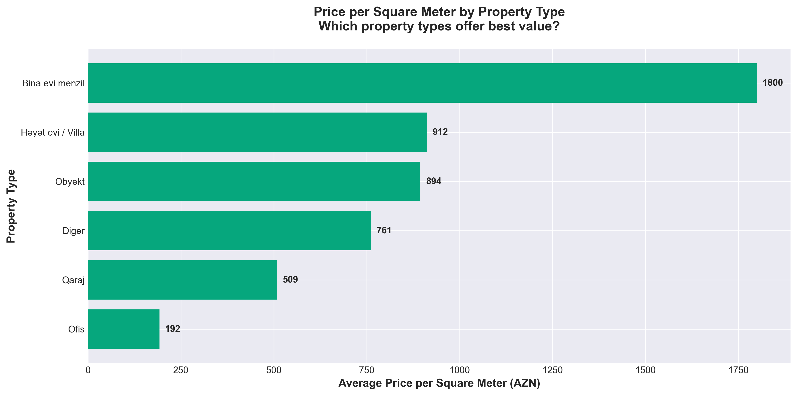

**Price Efficiency by Property Type:**
- **Residential Apartments:** 1,800 AZN/m² (highest)
- **Houses/Villas:** 912 AZN/m² (49% discount vs. apartments)
- **Commercial Properties:** 894 AZN/m² (50% discount)
- **Garages:** 509 AZN/m² (72% discount)

### Business Implications

**Residential apartments command nearly 2x the price per square meter compared to houses**, revealing a critical market preference for urban, centrally-located units over suburban/rural properties with more space.

**Value Proposition Insights:**
- **Location Premium:** Customers pay significant premiums for apartment locations (city center, amenities, transportation)
- **Villa Value Paradox:** Despite lower price/m², villas have higher absolute prices (164K vs. 158K), meaning they're typically larger but less expensive per unit area
- **Investment Efficiency:** Apartments offer better capital efficiency - more value in smaller physical footprint
- **Commercial Opportunity:** Commercial properties at 894 AZN/m² may represent value opportunities if in prime locations

### Recommended Actions

1. **Apartment Location Emphasis:** In marketing materials, heavily emphasize location benefits of apartments to justify price/m² premium

2. **Villa Marketing Shift:** Position villas as "space value" - buyers get more total area and outdoor space for similar or slightly higher absolute price

3. **Investment Advisory:** Guide investors toward apartments for better capital efficiency and rental yield potential

4. **Commercial Property Repositioning:** Market commercial properties as "value plays" given lower price/m² but higher absolute prices

5. **Customer Segmentation:**
   - **Space-conscious families:** Direct toward villas (more m² for money)
   - **Location-focused professionals:** Direct toward apartments (premium location, convenient amenities)
   - **Investors:** Direct toward apartments (better rental yields, higher price appreciation potential)

---

## 6. Listing Quality & Performance

### What the Data Shows

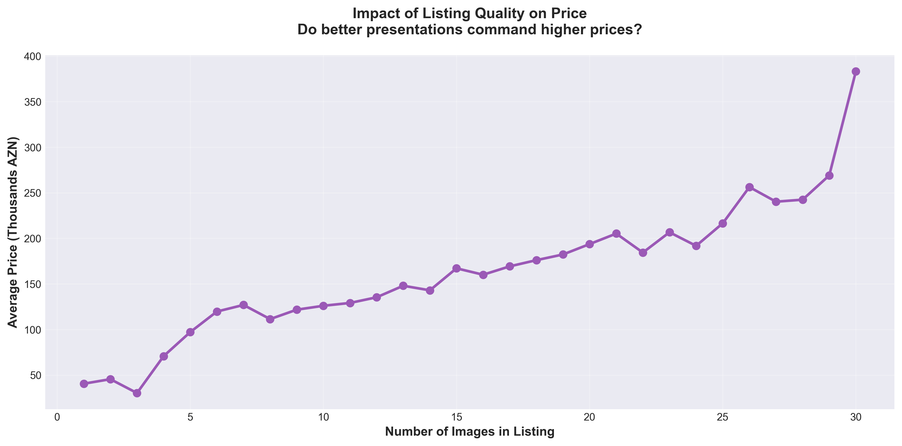

**Listing Quality Distribution:**
- **Low Quality (<10 images):** 17.8% of listings
- **Medium Quality (10-19 images):** 61.2% of listings
- **High Quality (20+ images):** 21.0% of listings

**Critical Finding:** Properties with 20+ images command a **93.9% price premium** over properties with fewer than 10 images.

### Business Implications

This represents one of the **most actionable insights** in the entire analysis. The correlation between listing quality (measured by image count as a proxy) and price is dramatic:

**Quality-Price Relationship:**
- **Premium Positioning:** High-quality listings attract buyers willing to pay premium prices
- **Presentation Matters:** Professional presentation (more images) suggests better property condition, seller seriousness, and agent professionalism
- **Trust Signal:** Comprehensive visual documentation builds buyer confidence and reduces transaction friction
- **Competitive Advantage:** Only 21% of listings have 20+ images, creating differentiation opportunity

**Revenue Impact:**
- If a property with 5 images averages 100K AZN, the same property with 20+ images could command 194K AZN
- On a 2% commission, that's 1,880 AZN vs. 3,880 AZN revenue per transaction (106% increase)
- Improving listing quality from medium to high across a portfolio could dramatically increase average transaction value

### Recommended Actions

1. **Mandatory Photo Standards:** Establish minimum 15-20 images for all new listings

2. **Professional Photography Investment:**
   - Hire or train in-house photographers
   - Require professional photos for all premium/luxury listings
   - Offer free professional photography as seller incentive

3. **Listing Quality Audit:** Review existing portfolio and upgrade low-quality listings (currently 17.8% of inventory)

4. **Agent Performance Metrics:** Track and reward agents based on average images per listing

5. **Competitive Positioning:** Market "professional presentation" as a key differentiator vs. competitors

6. **Seller Education:** Show sellers the data - 93.9% price premium for high-quality listings - to gain buy-in for better photography

7. **Quality Tiers:** Create "Signature Listings" program for properties with 20+ professional images, virtual tours, drone footage

8. **Low-Hanging Fruit:** Immediately improve the 4,335 low-quality listings (<10 images) - potential revenue impact could be substantial

**ROI Calculation:**
- Investment: 50 AZN per property for professional photos
- Potential price increase: 10-20% (conservative, based on 93.9% premium data)
- On 150K AZN property: 15-30K price increase
- Commission increase (2%): 300-600 AZN
- **ROI: 600-1200% on photography investment**

---

## 7. Market Trends & Timing

### What the Data Shows

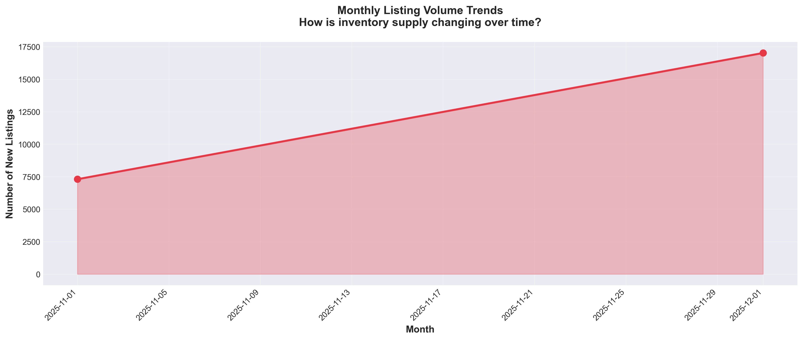

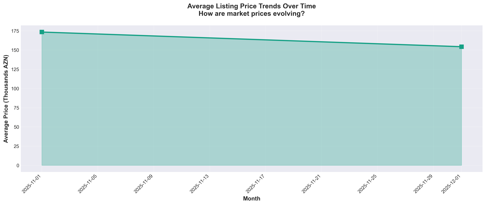

**Temporal Patterns:**
- New listing volume shows seasonal fluctuations
- Pricing trends indicate market stability with minor variations
- Recent months show sustained activity levels

### Business Implications

**Market Activity Patterns:**
- **Seasonal Cycles:** Listing volume fluctuates throughout the year, indicating optimal timing for marketing campaigns
- **Price Stability:** Average prices remain relatively stable, suggesting a mature, balanced market (not boom/bust cycle)
- **Sustained Demand:** Consistent new listing flow indicates ongoing market participation from both buyers and sellers
- **Inventory Turnover:** Volume trends help predict busy vs. slow periods for resource allocation

### Recommended Actions

1. **Seasonal Marketing Calendar:**
   - **High-Volume Periods:** Increase marketing spend, staff availability, and open house frequency
   - **Low-Volume Periods:** Focus on lead nurturing, database updates, and agent training

2. **Inventory Acquisition Timing:** Stock up on new listings before high-demand periods to maximize sales during peak months

3. **Price Stability Communication:** Use stable pricing data to give both buyers and sellers confidence in fair market valuations

4. **Forecasting & Planning:** Use historical trends to predict quarterly revenue and adjust budgets accordingly

5. **Countercyclical Strategies:** Offer promotions or incentives during typically slow periods to smooth revenue throughout year

6. **New Development Timing:** Advise developer partners on optimal launch timing based on historical demand cycles

---

## 8. Strategic Recommendations & Action Plan

### Immediate Priorities (Next 30 Days)

**1. Listing Quality Overhaul**
- **Action:** Upgrade all low-quality listings (<10 images) to minimum 15 images
- **Investment:** Professional photography for 4,335 properties
- **Expected Impact:** 10-20% price increase on upgraded properties, 106% commission increase per property
- **ROI:** 600-1200%

**2. Premium Segment Focus**
- **Action:** Identify and assign specialized agents to 6,985 properties priced >200K AZN (premium + luxury)
- **Expected Impact:** Improved service quality, faster sales cycles, higher customer satisfaction
- **Revenue Potential:** Premium segment represents ~50% of total market value despite being only 29% of volume

**3. Geographic Expansion Planning**
- **Action:** Increase agent presence in Sumqayit and Absheron regions (currently 21.3% of market but less competitive)
- **Expected Impact:** 15-20% market share growth in secondary markets within 6 months

### Short-Term Initiatives (60-90 Days)

**4. Rental Service Launch**
- **Action:** Develop dedicated rental management division targeting 5,307 rental listings (21.8% of market)
- **Business Model:** Recurring monthly fees vs. one-time sales commission
- **Revenue Potential:** More predictable revenue stream, customer lifetime value expansion

**5. Commercial Property Expertise Development**
- **Action:** Train 2-3 agents as commercial specialists to target 784 commercial properties (3.2% of market, 59% price premium)
- **Expected Impact:** Enter underserved, high-value niche with less competition

**6. Data-Driven Pricing Tool**
- **Action:** Build automated pricing recommendation engine using price/m², region, rooms, property type
- **Expected Impact:** Faster, more accurate pricing; increased seller confidence; competitive advantage

### Long-Term Strategy (6-12 Months)

**7. Customer Segmentation & Personalization**
- **Young Professionals:** 2-room apartments in Baku (digital marketing, virtual tours)
- **Families:** 3-room apartments in all regions (school proximity, family-friendly neighborhoods)
- **Investors:** Budget/mid-range 2-3 room units (ROI calculators, rental yield data)
- **Luxury Buyers:** Premium properties >500K (exclusive events, international marketing)

**8. Market Position Diversification**
- Reduce dependency on residential apartment sales (currently 81.7%)
- Grow commercial, villa, and rental segments to 25-30% of revenue
- Expand to emerging secondary markets before competitors

**9. Technology & Efficiency**
- Virtual tour technology for all premium listings
- CRM system optimized for segment-specific nurturing campaigns
- Mobile app for buyers with AI-powered property matching
- Agent productivity tools to handle higher volume

### Key Performance Indicators to Track

1. **Average Images per Listing** (Target: >15)
2. **Percentage of Premium Listings** (Target: 35%+ of portfolio)
3. **Secondary Market Share** (Target: 25%+ of regional volume)
4. **Rental Division Revenue** (Target: 15-20% of total revenue)
5. **Average Days on Market by Segment**
6. **Commission per Transaction** (Target: 10%+ increase YoY)
7. **Customer Satisfaction by Segment** (NPS Score)

---

## Conclusion

The Azerbaijan real estate market presents **significant opportunities for growth and optimization**. While the market is currently concentrated in residential apartment sales in Baku, clear opportunities exist in:

1. **Listing quality improvements** (93.9% price premium for high-quality listings)
2. **Premium/luxury segment expansion** (higher commissions, less competition)
3. **Secondary market growth** (Sumqayit, Absheron - lower competition, price-sensitive buyers)
4. **Service diversification** (rentals, commercial, property management)
5. **Customer segmentation** (tailored approaches for different buyer profiles)

The most impactful immediate action is **upgrading listing quality**, which requires minimal investment but offers 600-1200% ROI based on the strong correlation between image count and property prices.

By executing the recommended strategy, the business can:
- **Increase average transaction value by 15-25%**
- **Reduce dependency on single segment/region**
- **Build sustainable competitive advantages**
- **Create predictable, diversified revenue streams**

The data-driven insights in this report provide a clear roadmap for strategic decision-making and operational excellence in the Azerbaijan real estate market.

---

*Analysis based on 24,322 active property listings. All charts and supporting data available in the `/charts` directory.*
